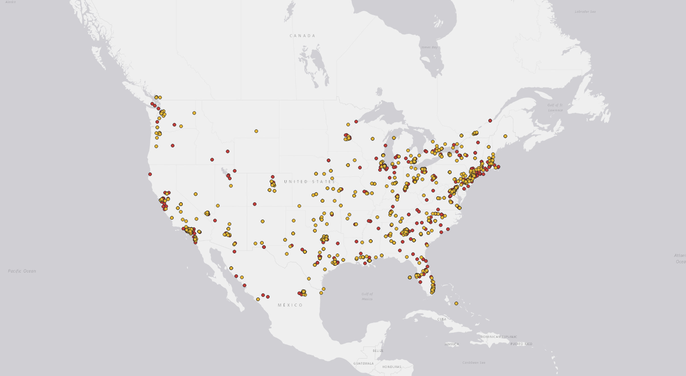

# Geo-tagged tweet collection and visualization
Fengyu Xu 2020.4.21

In this project, I used a [python crawler](geosearch.ipynb) to collected **twitter data in American related to a video game called "Monster Hunter"**.

```Python
LOCATIONS = [-124.7771694, 24.520833, -66.947028, 49.384472,  # Contiguous US
             -164.639405, 58.806859, -144.152365, 71.76871,  # Alaska
             -160.161542, 18.776344, -154.641396, 22.878623]  # Hawaii
stream.filter(locations=LOCATIONS)
```
I add a location bountry for the data, so it only shows the twitters posted in America.

First, I experienced with seceral keywrods first, like python, LGBTQ, MHXX. I found one interesting fact that no matter whay keywrods I use, most of the tweets are located in Washington State, Califronia and the NorthEast part. This might indicate that a large of twitter users are located there.

Then I came up with an thoughts to see if there's any location differences in user groups for two version of the video game "Monster Hunter"** since I am large fan of that.


 I used the keyword **"MHGU"** which the switch version of the game called "Monster Hunter Generations Ultimate". The distribution of posts geo location is shown in **yellow** dots.

Then I used the keyword **"MHW"** which is the PC version of the game called "Monster Hunter World". The data is represented by **red** dots.

```Python
stream.filter(track=['MHGU'], is_async=True)
```

By comparing those two sets of the data. We can see most tweets are posted in Washington State, Califronia or the NorthEast part of the US. Those are teh place where most of the users/players at.

However, in the middle area, we can find more yellow dots. This phenomenon indicated the differences of user groups. "MHGU" users also spread out in the middle rather than "MHW" user which highly focused in large cities.


